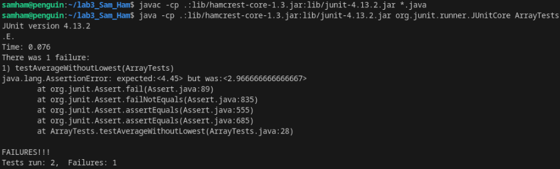

# Lab Report 3

By Sammy Hamouda

## Part 1 - Bugs

### 1. Failure-inducing code

```
@Test
public void testAverageWithoutLowest(){
  double[] input = {3.400, 5.50, 2.10, 2.100};
  assertEquals(4.45, ArrayExamples.averageWithoutLowest(input), 0.1);
} 
```

### 2. Working code

```
@Test
public void testAverageWithoutLowestEmpty(){
  double[] input = {};
  assertEquals(0.0, ArrayExamples.averageWithoutLowest(input), 0.1);
}
```


### 3. Symptom output



### 4. The bug before and after

#### Before
```
static double averageWithoutLowest(double[] arr) {
  if(arr.length < 2) { return 0.0; }
  double lowest = arr[0];
  for(double num: arr) {
    if(num < lowest) { lowest = num; }
  }
  double sum = 0;
  for(double num: arr) {
    if(num != lowest) { sum += num; }
  }
  return sum / (arr.length - 1);
}
```

#### After
```
static double averageWithoutLowest(double[] arr) {
  if(arr.length < 2) { return 0.0; }
  double lowest = arr[0];
  int count = 0;
  for(double num: arr) {
    if(num < lowest) { lowest = num; }
  }
  double sum = 0;
  for(double num: arr) {
    if(num != lowest) { 
      sum += num; 
    }else{
      count++;
    }
  }
  return sum / (arr.length - count);
}
```

### How the fix works
The original bug was the fact that averageWithoutLowest didn't account for the fact that there could be duplicates of the lowest number. This led to the average without being incorrectly calcuated. My fix addresses this by adding a counter that counts how many times the lowest number appears in the array, and then subtracting the array length by that count instead of just 1, which doesn't account for the fact that multiple numbers are possibly taken out of the lowest number appears multiple times.

## Part 2 - Researching Commands
I have gotten my commands from [geeksforgeeks](https://www.geeksforgeeks.org/grep-command-in-unixlinux/).

### grep with -i
1st Example
```
@Sam-Ham-UCSD ➜ /workspaces/sammydocsearch/technical (main) $ grep -i "planes" 911report/*.txt
911report/chapter-1.txt:"WE HAVE SOME PLANES"
...
911report/chapter-9.txt:                additional commercial planes were not accounted for. Prior to its evacuation, no
911report/chapter-9.txt:                the planes' impact to help others, or (4) on the two planes that crashed into
911report/chapter-9.txt:                planes, the capability of the sophisticated building systems may have been impaired.
```
Using `-i` with `grep` allows for a search ignoring capitalization, giving me all the lines that include planes, no matter if they are "Planes", "PLANES", or "planes."

2nd Example
```
@Sam-Ham-UCSD ➜ /workspaces/sammydocsearch/technical (main) $ grep -i "journal" plos/*.txt
plos/journal.pbio.0020001.txt:        which are mutually exclusive. It is possible that publishing in international journals as a
plos/journal.pbio.0020001.txt:        journals (
plos/journal.pbio.0020001.txt:        the 20 top ecological journals (with impact factors of 10.51–2.47) (ISI 2001a). We credited
plos/journal.pbio.0020001.txt:        For the top 20 ecological journals, the American subcontinents of South, Central, and
...
plos/pmed.0020272.txt:        PLoS Medicine (DOI: 10.1371/journal.pmed.0020124), that the majority of
plos/pmed.0020272.txt:        Research progress depends on dissemination of results, and journal articles are the most
plos/pmed.0020272.txt:        What can editors do? At high-impact journals such as 
plos/pmed.0020281.txt:        Amendment work of responsible journalists, who exemplify the best in investigatory
```
This use of `-i` allows me to look for whereever the word journal is used, whether it is capitalized or not. This allows me to better estimate how many times the word is actually used.

### grep with -c
1st example
```
@Sam-Ham-UCSD ➜ /workspaces/sammydocsearch/technical (main) $ grep -c "gene" biomed/*.txt
biomed/1468-6708-3-1.txt:0
biomed/1468-6708-3-10.txt:1
biomed/1468-6708-3-3.txt:1
...
biomed/rr191.txt:32
biomed/rr196.txt:12
biomed/rr37.txt:12
biomed/rr73.txt:4
biomed/rr74.txt:2
```
The `-c` option is very useful as it only tells you how many times a phrase appears in a file rather than showing the line. This is useful because the terminal wouldn't be able to show all results otherwise.

2nd Example
```
@Sam-Ham-UCSD ➜ /workspaces/sammydocsearch/technical (main) $ grep -c "alcohol" government/Alcohol_Problems/DraftRecom-PDF.txt
53
```
Using the `-c` command on a singular file is also useful as you don't need to count the lines yourself where a word appears, as it will just tell you.

### grep with -l
1st Example
```
@Sam-Ham-UCSD ➜ /workspaces/sammydocsearch/technical (main) $ grep -l "alcohol" government/Alcohol_Problems/*.txt
government/Alcohol_Problems/DraftRecom-PDF.txt
government/Alcohol_Problems/Session2-PDF.txt
government/Alcohol_Problems/Session3-PDF.txt
government/Alcohol_Problems/Session4-PDF.txt
```
The `-l` command lists the files that contains the words rather than the lines. This is very useful when you are trying to find the files and then specify further rather than having to look through the terminal for what you are looking for.

2nd Example
```
@Sam-Ham-UCSD ➜ /workspaces/sammydocsearch/technical (main) $ grep -l "DNA and RNA" biomed/*.txt
biomed/1471-2091-2-13.txt
biomed/1471-2164-3-15.txt
biomed/1476-4598-1-3.txt
biomed/1476-4598-1-8.txt
biomed/ar68.txt
```
With a more specific phrase like "DNA and RNA" I was able to find the files that say these exact terms in a sentence. This saves me time searching for these files throughout the many contained in `/biomed`.

### grep with -v
1st Example
```
@Sam-Ham-UCSD ➜ /workspaces/sammydocsearch/technical (main) $ grep -v "and" plos/pmed.0020074.txt
        Acquired resistance to chemotherapy is a major obstacle to successful cancer treatment.
        to identifying new drugs or combination regimens.
        Kinases are signaling molecules that control many aspects of cell behavior, including
        design. One target for kinase inhibitors is the epidermal growth factor receptor (EGFR).
        the EGFR gene, which somehow make the tumors sensitive to treatment. Nearly all patients
        whose tumors initially respond to EGFR inhibitors, however, eventually become resistant to
        cancer who initially responded to gefitinib or erlotinib but subsequently relapsed. Tumors
        from all six patients carried activating mutations in the EGFR gene. In addition, in three
        out of the six cases, the resistant tumor cells carried an identical second mutation in the
        EGFR gene. Whereas the activating mutation was present in tumor cells before treatment with
        erlotinib or gefitinib, the second mutation was not found in pre-treatment biopsies from
        these patients, nor in over 150 lung cancer samples from patients who had not been treated
        with either drug. Additional cell culture studies supported the notion that the secondary
        mutation causes resistance to gefitinib or erlotinib. It is clear, though, that this is
        only one mechanism of resistance, because in the three other cases resistance occurred in
        the absence of the second mutation. What caused the resistance in those tumors is not
        known.
        one identified here has also been found in other kinase genes from tumors with acquired
        out in an accompanying Perspective (DOI: 10.1371/journal.pmed.0020075), the initial
        identification three years ago of resistance mutations against imatinib led to the rapid
        development of alternative kinase inhibitors that work even against tumors with the
        develop second generation drugs for lung cancer.
```
`-v` allows you to search for lines that don't include the phrase that you are looking for. In this case I decided to look for lines that that don't inlcude "and".

2nd Example
```
@Sam-Ham-UCSD ➜ /workspaces/sammydocsearch/technical (main) $ grep -v "UC" plos/pmed.0020273.txt

  
    
      
        
        Inflammatory bowel disease (IBD) is the term that encompasses chronic relapsing diseases
        disease (CD). They are common disorders; in the UK, for example, together they affect about
        than 1 million cases in the US and Europe. The symptoms for both these conditions—which
        suggest an abnormal immune response at the intestinal mucosa—include abdominal pain,
        diarrhea, fever, severe fatigue, and weight loss. Current understanding of disease
        pathogenesis suggests a complex action of multiple environmental factors that trigger
        disease in individuals with a susceptible genetic background.
        Today, finding genes that have a role in diseases has been made easier by the sequencing
        of the human genome and creation of an expressed sequence tag clone database. Previous
        positional cloning studies have revealed three genes associated with IBD that carry
        variants with a causative role. Another of the tools for analyzing genes is microarray
        technology, in which the expression of transcripts of thousands of genes can be
        investigated simultaneously. This approach offers an insight into disease
        pathophysiology.
        In a research article published in 
        PLoS Medicine , Christine Costello and colleagues have gone further with
        cDNA microarrays to attempt to decipher gene regulatory events and identify genes that
        might be involved in the pathophysiology of these IBD. They found 650 genes that were
        differentially regulated between normal control individuals and the individuals with one of
        the two IBD subtypes. In fact, 500 and 272 differentially regulated transcripts were
        an imbalance between over- and underexpressed genes in the IBD subtypes. In CD,
        approximately 84% of differentially expressed genes were found to be down-regulated
        influenced by the types and numbers of genes present on any microarray system; in addition,
        disease and underexpressed in the other. These observations support the notion of a shared
        general inflammatory profile underlying each form of IBD, with more specific events in the
        pathophysiological cascade being disease-specific.
        In a second part of the study, the team tried to interpret the functional consequences
        of changes in gene expression observed in the microarray analysis. They used an
        annotation-based pathway database, which classified differentially expressed genes into
        three major groups: immune and inflammatory response; oncogenesis, cell proliferation, and
        growth; or structure and permeability. For immune and inflammatory response, the team
        identified many genes associated with aberrant immune response; it is not surprising,
        perhaps, to find a general up-regulation of immune response and antigen presentation in
        finding similar to previous microarray studies that had reported involvement of
        cancer-related genes in IBD (although the altered genes were different). There was also an
        enrichment of genes associated with structure and permeability; in this class several genes
        were ubiquitously altered in both IBD and non-IBD samples, reflecting dysregulation of
        genes for paracellular permeability, degradation of extracellular matrix, and barrier
        protection against bacterial invasion of the epithelial surface.
        some possible future avenues for research of mucosal diseases in general. It demonstrates
        that genomic technologies are suitable to directly dissect human pathophysiology.
```
This use of `-v` allowed me to exclude the lines where they use the acronym of "UC" for "ulcerative colitis" in the text file. This allows me to see when they aren't talking about "ulcerative colitis" in this specific file. 
