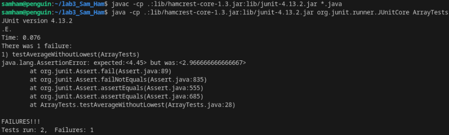

# Lab Report 4

By Sammy Hamouda

## Step 4

### 1. Failure-inducing code

```
@Test
public void testAverageWithoutLowest(){
  double[] input = {3.400, 5.50, 2.10, 2.100};
  assertEquals(4.45, ArrayExamples.averageWithoutLowest(input), 0.1);
} 
```

### 3. Symptom output


## Step 5

## Step 6

## Step 7

## Step 8

## Step 9

