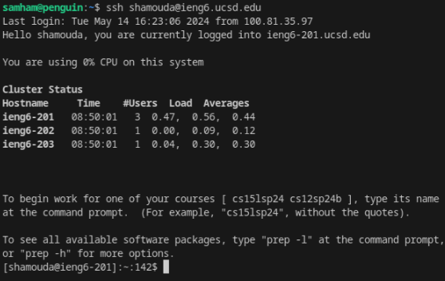
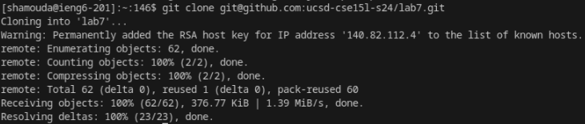
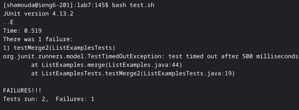
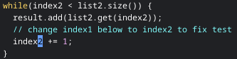
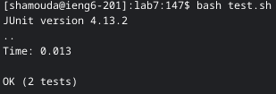
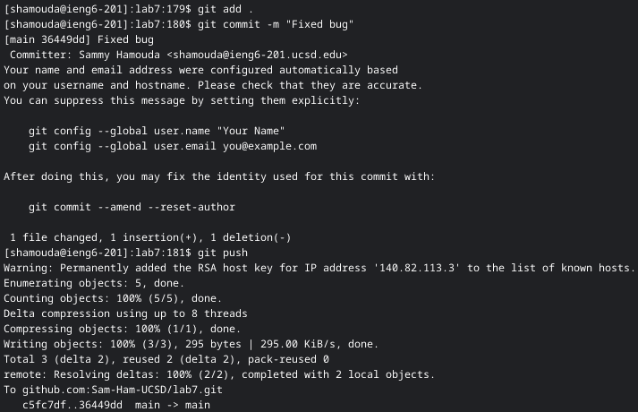

# Lab Report 4

By Sammy Hamouda

## Step 4

Keys pressed: `<up>` and `<enter>`

Explanation: I had the command for logging into my ieng6 account one command above so I used that to skip the typing process.

## Step 5

Keys pressed: `<g><i><t>< ><c><l><o><n><e>< ><CTRL><SHIFT><V><enter>`

Explanation: I had copied the ssh link from the git hub page using a mouse click and then typed out the command to clone the link into a new directory.

## Step 6

Keys pressed: `<c><d>< ><l><a><b><7><enter>`, `<b><a><s><h>< ><t><e><s><t><.><s><h><enter>`

Explanation: I changed my directory to the one created from cloning the git repository, and then ran the `test.sh` file with `bash` to see the results of the tests.

## Step 7

Keys pressed: `<v><i><m>< ><SHIFT><l><i><s><t><SHIFT><e><x><a><m>
<l><e><s><.><j><a><v><a><enter>`, `</><i><n><d><e><x><enter>`, `<down><down><down><right><right>`, `<i><backspace><1><esc>`, `<:><w><q><enter>`

Explanation: I used vim to edit `ListExamples.java`, the `/` command allowed me to search for the word `index` in the file and then `<i>` pressed enter to where the cursor had appeared to get to that spot. I then moved to what I needed to edit with the series of downs and rights, entered insert mode with `<i>`, fixed the error and exited. I finally saved the changes with `:wq`.

## Step 8

Keys pressed: `<up><up><enter>`

Explanation: My command to run the tests was two commands up so I moved to that command and ran it again with `<enter>`.

## Step 9

Keys pressed: `<g><i><t>< ><a><d><d>< ><.><enter>`, `<g><i><t>< ><c><o><m><m><i><t>< ><-><m>< ><SHIFT><"><F><i><x><e><d>< ><b><u><g><s><SHIFT><"><enter>`, `<g><i><t>< >
<u><s><h><enter>`

Explanation: I used `git add .` to prepare the files to be uploaded to git, then `git commit` with the `-m` to comment about what changes I had made, and then finally, I used `git push` to send the changes to my forked repository.
